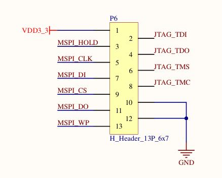

<h1 align = "center"> 🌟T-FPGA🌟</h1>

## Description

The circuit board is an integrated ESP32S3 and FPGA (GW1NSR-LV4CQN48PC6/I5) control chip. With the power management AXP2101 can be used to switch the voltage of different BANK areas. And there are as many as 6 data lines for communication between FPGA and MCU.

## Pinout


## Where to buy

T-FPGA is available from: [LILYGO](https://www.lilygo.cc/products/t-fpga), [Aliexpress](https://github.com/Xinyuan-LilyGO/T-FPGA).

## Quick Start 
>## ESP32-S3:
>The board uses USB as the JTAG upload port. When printing serial port information >on USB, CDC_ON_BOOT configuration needs to be turned on. 
>If the port cannot be found when uploading the program or the USB has been used >for other functions, the port does not appear. 
>Please enter the upload mode manually. 
>-  Press and hold the BOOT button when the power is off, the button is located >behind the RST button.
>-  When the USB is connected, first press and hold the BOOT button, then click >reset and then release the BOOT button
>
>### Arduino
>
>1. In Arduino Preferences, on the Settings tab, enter the `https://raw.githubusercontent.com/espressif/arduino-esp32/gh-pages/package_esp32_index.json` 
>URL in the `Additional boards manager URLs` input box.
>2. Click OK and the software will install.
>3. Search for ESP32 in Tools → Board Manager and install ESP32-Arduino SDK >(version 2.0.3 or above)
>
>4. Copy everything from this repository lib folder to [Arduino library folder]>(https://docs.arduino.cc/software/ide-v1/tutorials/>installing-libraries#manual-installation) (e.g. >`C:\Users\YourName\Documents\Arduino\libraries`)
>5. Select the correct settings in the Tools menu as shown below.
>
>| Setting                  | Value                            |
>| :----------------------- | :------------------------------- |
>| Board                    | ESP32 S3 Dev Module              |
>| USB CDC On Boot          | Enabled                          |
>| CPU Frequency            | 240MHz (WiFi)                    |
>| Core Debug Level         | None                             |
>| USB DFU On Boot          | Enabled                          |
>| Events Run On            | Core 1                           |
>| Flash Mode               | QIO 80MHz                        |
>| Flash Size               | 16MB (128Mb)                     |
>| JTAG Adapter             | Integrated USB JTAG              |
>| Arduino Runs On          | Core 1                           |
>| USB Firmware MSC On Boot | Disabled                         |
>| Partition Scheme         | Huge APP (3MB No OTA/1MB SPIFFS) |
>| PSRAM                    | OPI PSRAM                        |
>| USB Mode                 | Hardware CDC and JTAG            |
>
>### PlatformIO
>
>1. PlatformIO plug-in installation: click on the extension on the left column → >search platformIO → install the first plug-in
>2. Click Platforms → Embedded → search Espressif 32 in the input box → select the >corresponding firmware installation
>
>### ESP-IDF
>
>The installation method varies depending on the system, refer to the [official >manual](https://docs.espressif.com/projects/esp-idf/en/latest/esp32/get-started/>index.html) for installation.

>## GW1NSR-LV4CQN48PC6/I5
>### Software Introduction
>1. Enter the official download page Technical Support Click to download different >versions of EDA software.  
>[Download page](https://www.gowinsemi.com/en/support/database/14/)
>
>- `Note`: The normal version needs to obtain the application license file to >activate. Educational Edition is not required.
>- [License application](https://www.gowinsemi.com/en/support/license/) takes about >24 hours.
>2. You can see this interface when you open the software after the installation is >complete. Click New Project to get started.
>
>
>3. Select the consistent chip selection as shown below to complete the new project >steps.
>
>
>4. Right click and add a new file named led in the left file list box.  
>
>
>
>
>
>5. Edit an example where the logic is to reverse the state of the IO port when the >BUTTON is pressed.
>```
>module led(
>    input clk,
>    output reg led
>);
>
>
>always @(posedge clk) begin
>     led<=!led;
>end
>
>endmodule
>```
>6. In the configuration interface, select the main module as the led.v module.  
>
>
>
>7. Click the last button for global simulation programming.  
>
>
>8. Click Create Pin Mapping. Left-click and drag to the corresponding chip pin.
>
>
>
>
>9. After rebuilding once. Click the upload function below.
>- First, you need to open the [zadig](https://zadig.en.lo4d.com/windows) software >to initialize the driver.
>
>
>
>
>10. Finally click the download button to complete all steps.
>


## Q&A

1. Q: Connecting the FPGA-JTAG USB interface does not pop up a new device or the program cannot be successfully uploaded to the FPGA chip
- A: Because the BANK area of the FPGA chip requires different power supply voltages. During initialization, the ESP32-S3 needs to correct the voltage of the PMU and turn it on before it can work normally.

- The solution is to let ESP32-S3 upload `T-FPGA\example\ESP32-S3\turn_on_power` program first. The purpose of this procedure is to turn on the PMU voltage.

2. JTAG Connector Model

* [0.3K-HX-13PWB](https://item.szlcsc.com/3222443.html)


